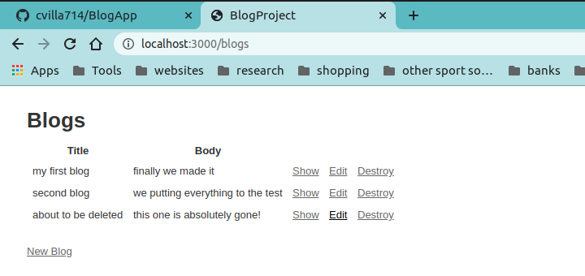

# Blog App

> Project was about creating a blog using rails it has
>the functions of creating new blogs, editing and destroying blogs.

## Built With

- Ruby
- Rails
- Postgres

To get a local copy up and running follow these simple example steps.

### Prerequisites
- You need to have ruby install
- Rails installed
- Postgres

## Authors

👤 **Angela Vukadinovic**

- GitHub: [https://github.com/410AngelaVu]
- Twitter: [https://twitter.com/andjelavukadin7]
- LinkedIn: [https://www.linkedin.com/in/andjela-vukadinovic-67a21b1b2/]

👤 **Devkc**

- Github: [@cvilla714](https://github.com/cvilla714)
- Twitter: [@kckeyti](https://twitter.com/kckeyti)
- Linkedin: [linkedin Profile](https://www.linkedin.com/in/cosmel-villalobos-1900531aa/)
## 🤝 Contributing

Contributions, issues, and feature requests are welcome!

Feel free to check the [issues page](issues/).

## Show your support

Give a ⭐️ if you like this project!